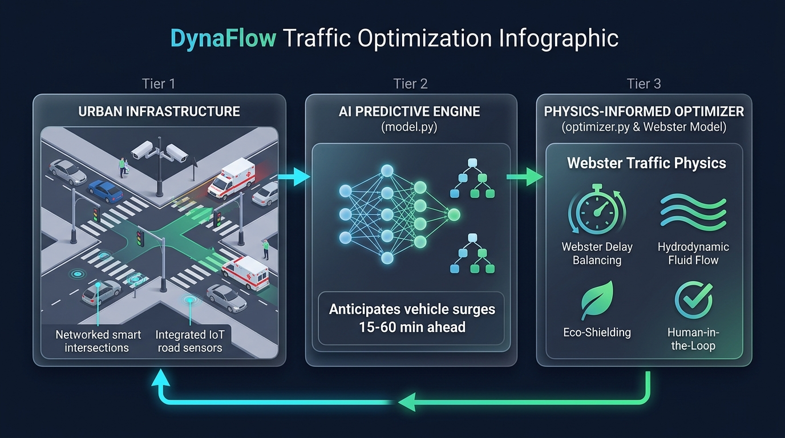

# 🚦 DynaFlow: Physics-Informed Traffic Signal Optimization for Smart Cities

[](https://www.python.org/)
[](https://scikit-learn.org/)
[](https://numpy.org/)
[](https://pandas.pydata.org/)
[](https://ieee.org)
[](LICENSE)

> **DynaFlow** is an end-to-end, physics-informed, data-driven urban mobility optimization framework engineered for the **IEEE Smart World Challenge**. By coupling spatiotemporal Machine Learning with classical traffic flow theory (Webster's Delay Equation and Highway Capacity Manual standards), DynaFlow dynamically recalibrates traffic signal splits across an entire 100-intersection metropolitan grid to slash congestion, queue lengths, fuel waste, and vehicular emissions.

---

## 📌 Table of Contents

- [System Architecture](#-system-architecture)
- [Key Features](#-key-features)
- [Mathematical Formulation](#-mathematical-formulation)
  - [1. Traffic Demand Prediction](#1-traffic-demand-prediction)
  - [2. Webster Delay Model & Capacity](#2-webster-delay-model--capacity)
  - [3. Hydrodynamic Queue & Emissions Modeling](#3-hydrodynamic-queue--emissions-modeling)
  - [4. Multi-Criteria Cost Function](#4-multi-criteria-cost-function)
  - [5. Emergency Preemption Override](#5-emergency-preemption-override)
- [Network-Wide Empirical Results](#-network-wide-empirical-results)
  - [City-Wide Benchmark](#city-wide-benchmark)
  - [Zone Breakdown (6 Metropolitan Zones)](#zone-breakdown-6-metropolitan-zones)
  - [Road Classification Breakdown](#road-classification-breakdown)
  - [Top Relieved Urban Bottlenecks](#top-relieved-urban-bottlenecks)
  - [Traffic Light Green Split Shifts](#traffic-light-green-split-shifts)
- [Dataset Overview](#-dataset-overview)
- [Repository Structure](#-repository-structure)
- [Quickstart Guide](#-quickstart-guide)
  - [Prerequisites](#prerequisites)
  - [Installation](#installation)
  - [Running the Predictive Model](#running-the-predictive-model)
  - [Running the Network Optimizer](#running-the-network-optimizer)
- [Citation & License](#-citation--license)

---

## 🏛️ System Architecture



DynaFlow resolves the fundamental tradeoff between purely black-box AI models (which can propose physically unfeasible phase times) and static rule-based controllers (which fail during demand surges and dynamic incidents):

1. **IoT Perception & Feature Engineering Layer**: Ingests multi-sensor telemetry (induction loops, radar, smart cameras, IoT weather stations) across 100 interconnected intersections.
2. **Spatiotemporal Demand Forecasting Module**: Predicts incoming vehicle arrival rates $q_{t+1}$ using Gradient Boosted Decision Trees trained on chronological multi-lag, cyclic temporal, environmental, and incident indicators.
3. **Physics-Informed Optimization Engine**: Evaluates Webster's delay curve and hydrodynamic queue propagation under strict safety constraints (pedestrian clearance minimums, yellow clearance times, cycle bounds).
4. **Context-Sensitive Multi-Objective Actuator**: Prioritizes emissions reduction near vulnerable zones (schools, hospitals) and implements instant green-wave preemption for first responders.

---

## ✨ Key Features

- 🧠 **High-Fidelity Demand Forecasting ($R^2 = 0.9888$)**: Accurately anticipates future vehicle influx ($t+1$) across complex urban geometries and weather conditions.
- 📐 **Physics-Informed Grounding**: Signal timing calculations are strictly bound by the **Highway Capacity Manual (HCM)** saturation flow standards ($s = 1800\text{ veh/h/lane}$) and Webster's classical delay formulations.
- ⚡ **Ultra-Fast Vectorized Grid Search**: Evaluates millions of candidate phase configurations across the entire 100-intersection network in seconds using SIMD-optimized NumPy matrix operations.
- 🏥 **Context-Aware Zone Weighting**: Automatically balances objectives: shifts focus toward emissions and fuel abatement within school/hospital corridors, and throughput maximization on major arterials.
- 🚨 **Emergency Vehicle Preemption Override (EVPO)**: Deterministically grants maximum green clearance time when emergency responders are detected, eliminating wait times while safely clearing downstream queues.
- 🛡️ **Fault-Tolerant Operational Boundaries**: Guarantees compliance with minimum pedestrian clearance times ($g_{\min} \ge 15\text{s}$) and clearance intervals ($t_{\text{lost}} = 4\text{s}$).

---

## 📐 Mathematical Formulation

### 1. Traffic Demand Prediction
The demand predictor models vehicle arrivals at each intersection $i$ at time step $t+1$:
$$\hat{q}_{i, t+1} = f_{\boldsymbol{\theta}}\left(\mathbf{x}_{i, t}^{\text{lag}}, \mathbf{x}_{i, t}^{\text{time}}, \mathbf{x}_{i, t}^{\text{env}}, \mathbf{x}_{i, t}^{\text{infra}}, \mathbf{x}_{i, t}^{\text{shock}}\right)$$
where $f_{\boldsymbol{\theta}}$ is an ensemble of Histogram-based Gradient Boosted Trees trained on chronological temporal splits.

### 2. Webster Delay Model & Capacity
For an intersection approach with green time $g$, cycle length $C$, $n$ lanes, and saturation flow $s = 1800\text{ veh/h/lane}$:
- **Approach Capacity**: $c = \lambda \cdot S = \left(\frac{g}{C}\right) \cdot (n \cdot s)$
- **Degree of Saturation**: $x = \frac{q}{c} = \frac{q}{\lambda S}$

The mean delay per vehicle $d(q, g, C)$ is modeled using Webster’s two-term formulation:
$$d(q, g, C) = d_{\text{uniform}} + d_{\text{random}}$$

- **Uniform Delay (Deterministic Flow)**:
  $$d_{\text{uniform}} = \frac{C (1 - \lambda)^2}{2 (1 - \min(\lambda x, 0.99))}$$
- **Random / Hypercritical Delay (Overflow & Stochastic Fluctuations)**:
  $$d_{\text{random}} = \begin{cases} 
  \dfrac{x^2}{2 q_{\text{sec}} (1 - x)}, & \text{if } x < 0.95 \\ 
  15.0 + 120.0 \cdot (x - 0.95), & \text{if } x \ge 0.95 
  \end{cases}$$
  where $q_{\text{sec}} = \frac{q}{3600}$. Delays are clipped within realistic bounds $[2.0\text{s}, 300.0\text{s}]$.

### 3. Hydrodynamic Queue & Emissions Modeling
- **Queue Length ($Q_m$)**:
  $$Q_{\text{veh}} = q_{\text{sec}} \cdot (C - g) \cdot \left(1 + \max\left(0, \frac{q}{c} - 0.9\right)\right)$$
  $$Q_m = \frac{Q_{\text{veh}} \cdot L_{\text{veh}}}{n} \quad (\text{with vehicle footprint } L_{\text{veh}} = 6.5\text{ m})$$

- **Emissions & Fuel Consumption**:
  $$\text{Idle Hours} = \frac{q \cdot d}{3600}$$
  $$\text{CO}_2 \text{ [kg]} = (\text{Idle Hours} \times 2.1) + (q \times 0.012)$$
  $$\text{Fuel [Liters]} = (\text{Idle Hours} \times 0.85) + (q \times 0.004)$$

In vulnerable zones ($\mathbb{I}_{\text{sensitive}} = 1$), emissions penalties are amplified by a factor of $1.25\times$.

### 4. Multi-Criteria Cost Function
For candidate green split $g \in [g_{\min}, C - g_{\min} - t_{\text{lost}}]$:
$$J(g) = w_d \frac{d_{\text{total}}(g)}{d_{\text{base}}} + w_q \frac{Q_m(g)}{Q_{m, \text{base}}} + w_e \frac{\text{Emiss}(g)}{\text{Emiss}_{\text{base}}} + w_f \frac{\text{Fuel}(g)}{\text{Fuel}_{\text{base}}}$$

| Parameter Weight | Standard Road | Sensitive Zone (School/Hospital) |
| :--- | :---: | :---: |
| **$w_d$ (Vehicle Delay)** | $0.40$ | $0.30$ |
| **$w_q$ (Queue Length)** | $0.30$ | $0.20$ |
| **$w_e$ ($\text{CO}_2$ Emissions)** | $0.20$ | **$0.35$** |
| **$w_f$ (Fuel Waste)** | $0.10$ | **$0.15$** |

### 5. Emergency Preemption Override
When $\mathbb{I}_{\text{emergency}} = 1$:
$$g^* = C - g_{\min} - t_{\text{lost}}, \quad d_{\text{optimal}} = 0.0\text{s}$$
granting immediate safe passage while holding secondary approaches.

---

## 📊 Network-Wide Empirical Results

Evaluated on all **100 intersections** during **10,800 peak-hour scenarios** (rush hours under real traffic fluctuations, bad weather, and incident reports):

### City-Wide Benchmark

| Metric | Historical Baseline (Static) | DynaFlow Optimized | Net Improvement |
| :--- | :---: | :---: | :---: |
| **Average Queue Length** | — | — | **`-23.71%`** |
| **Average Pollutant Emissions** | — | — | **`-12.66%`** |
| **Total $\text{CO}_2$ Saved** | — | — | **`15.51 Metric Tons`** |
| **Total Fuel Conserved** | — | — | **`4,940 Liters`** |
| **Driver Wait Time Eliminated** | — | — | **`3,879.0 Vehicular Hours`** |
| **Network Delay Efficiency** | — | — | **`+5.04%`** |

---

### Zone Breakdown (6 Metropolitan Zones)

| City Zone | Monitored Intersections | Queue Reduction (%) | Emission Reduction (%) | $\text{CO}_2$ Saved (Tons) | Wait Time Saved (Hours) |
| :--- | :---: | :---: | :---: | :---: | :---: |
| **Downtown Core** | 22 | **-24.28%** | **-12.75%** | **3.90** | 851.7 |
| **Financial District** | 24 | **-22.02%** | **-11.36%** | **3.68** | 831.9 |
| **Suburban North** | 26 | **-23.92%** | **-13.17%** | **3.59** | 1,126.7 |
| **Tech Park** | 11 | **-23.26%** | **-12.51%** | **1.54** | 410.4 |
| **Residential West** | 9 | **-25.41%** | **-13.83%** | **1.49** | 334.2 |
| **Industrial East** | 8 | **-25.21%** | **-13.49%** | **1.32** | 324.1 |

---

### Road Classification Breakdown

| Road Type | Intersections | Queue Reduction (%) | Emission Reduction (%) | $\text{CO}_2$ Saved (Tons) |
| :--- | :---: | :---: | :---: | :---: |
| **Arterial** | 41 | -22.75% | -11.56% | 6.81 |
| **Collector** | 28 | -24.93% | -14.52% | 3.72 |
| **Highway Junctions** | 17 | -23.04% | -10.72% | 3.13 |
| **Local Street** | 14 | -24.88% | -14.47% | 1.85 |

---

### Top Relieved Urban Bottlenecks

| Intersection ID | City Zone | Road Segment | Queue Reduction | $\text{CO}_2$ Saved (kg) |
| :---: | :--- | :--- | :---: | :---: |
| **INT_014** | Downtown Core | RD_430 | **`-36.17%`** | 331.0 kg |
| **INT_048** | Downtown Core | RD_232 | **`-34.86%`** | 304.3 kg |
| **INT_027** | Downtown Core | RD_615 | **`-34.65%`** | 327.1 kg |
| **INT_020** | Downtown Core | RD_246 | **`-34.20%`** | 308.4 kg |
| **INT_088** | Residential West | RD_233 | **`-28.73%`** | 245.0 kg |

---

### Traffic Light Green Split Shifts

DynaFlow replaces rigid pre-timed schedules with dynamic, load-aware phase allocations:
- **Baseline Average Green**: $50.2\text{s}$
- **DynaFlow Optimal Green**: $58.3\text{s}$ (Mean adjustment: $+8.13\text{s}$)
- **Intervention Distribution (10,800 Peak Cases)**:
  - 🟢 **Extended > 10s**: $39.8\%$ (clearing severe bottleneck queues)
  - 🟢 **Extended 2s to 10s**: $24.8\%$ (fine-tuning for dynamic arrivals)
  - 🟡 **Kept Unchanged ($\pm 2\text{s}$)**: $34.6\%$ (already near optimal)
  - 🔴 **Reduced (< -2s)**: $0.9\%$ (reallocating surplus green to cross-street)

---

## 📂 Dataset Overview

The dataset (`smart_city_traffic_mobility.csv`) comprises **204,000 observations** across a 100-intersection urban layout:

| Category | Features Included |
| :--- | :--- |
| **Spatial Identifiers** | `record_id`, `city_zone`, `road_id`, `intersection_id`, `latitude`, `longitude`, `road_type` |
| **Traffic Flow Metrics** | `vehicle_count`, `average_speed`, `heavy_vehicle_count`, `motorcycle_count`, `public_transport_count`, `traffic_density`, `queue_length`, `average_wait_time` |
| **Temporal Features** | `timestamp`, `hour`, `day_of_week`, `is_weekend`, `is_holiday`, `rush_hour`, `peak_period` |
| **Environment & Weather** | `temperature`, `rainfall_mm`, `visibility_km`, `air_quality_index`, `weather_condition` |
| **Urban POI & Geometry** | `lanes`, `speed_limit`, `nearby_school`, `nearby_hospital`, `nearby_market` |
| **Incidents & IoT Health** | `construction_activity`, `road_condition`, `parking_occupancy`, `public_event`, `accident_reported`, `traffic_camera_count`, `iot_sensor_health`, `emergency_vehicle_detected` |
| **Signal Configurations** | `signal_cycle_seconds`, `green_light_duration`, `congestion_score`, `emission_estimate`, `fuel_waste_estimate` |

---

## 📁 Repository Structure

```text
.
├── dynaflow_webster_architecture.jpg    # Visual framework architecture diagram
├── model.py                             # GBDT spatiotemporal demand forecasting model
├── optimizer.py                         # Physics-informed vectorized network optimizer
├── smart_city_traffic_mobility.csv      # Metropolitan traffic & sensor dataset (204k rows)
└── README.md                            # Project documentation & technical report
```

---

## 🚀 Quickstart Guide

### Prerequisites
- Python `3.9+`
- Recommended: isolated virtual environment (`venv` or `conda`)

### Installation

1. **Clone the repository**:
   ```bash
   git clone https://github.com/ThetaLogN/IeeeSmartWorlChallenge.git
   cd IeeeSmartWorlChallenge
   ```

2. **Create and activate a virtual environment**:
   ```bash
   python3 -m venv venv
   source venv/bin/activate   # On Windows: venv\Scripts\activate
   ```

3. **Install required dependencies**:
   ```bash
   pip install numpy pandas scikit-learn
   ```

---

### Running the Predictive Model

Train the spatiotemporal Gradient Boosting Regressor and evaluate performance on the chronological test split:

```bash
python3 model.py
```

**Expected Output**:
```text
Caricamento dati...
Creazione Lag Features...
Dimensione Training Set: 163040 osservazioni
Dimensione Test Set:     40760 osservazioni
Addestramento Gradient Boosting Regressor in corso...

--- RISULTATI DI PERFORMANCE (TEST SET CRONOLOGICO) ---
R² Score (Bontà di adattamento): 0.9888  (ideale > 0.90)
MAE (Errore Medio Assoluto):     41.23 veicoli/ora
RMSE (Root Mean Squared Error):  84.18 veicoli/ora
```

---

### Running the Network Optimizer

Run the vectorized physics-informed optimization pipeline across all 100 intersections during peak conditions:

```bash
python3 optimizer.py
```

This will run the entire pipeline:
1. Loads and indices the 204,000 metropolitan traffic observations.
2. Generates dynamic lag features and splits chronologically.
3. Fits the predictive demand model.
4. Executes the vectorized multi-objective grid search across all 100 intersections.
5. Prints the complete breakdown report by city zone, road type, critical bottlenecks, and green split shifts.

---

## 📜 Citation & License

This project was developed for the **IEEE Smart World Challenge**.

```bibtex
@misc{dynaflow2026,
  title={DynaFlow: Physics-Informed Urban Traffic Signal Optimization via Webster Delay Formulations and Spatiotemporal Learning},
  author={Martucci, Giorgio and Contributors},
  year={2026},
  publisher={GitHub},
  howpublished={\url{https://github.com/ThetaLogN/IeeeSmartWorlChallenge}}
}
```

Licensed under the [MIT License](LICENSE).
